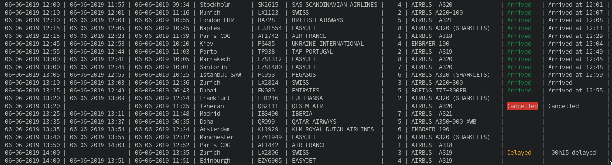

# go-gvacli

Just a Go version of https://github.com/nbarrientos/gvacli for Linux and Windows (CLI)

## Flags

* `--api-url`: Override the URL of the API endpoint
* `--api-timeout`: Override the timeout for the API endpoint
* `--code-shares`: Show code shares on flights
* `--all-flights`: Show departures as well

## Screenshot

## Source of data

Comes from GVA Airport website: https://gva.ch
