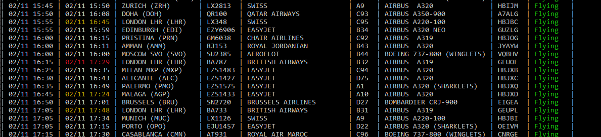

# go-gvacli

Just a Go version of https://github.com/nbarrientos/gvacli for Linux and Windows (CLI)

## Flags

* `--all-flights`: Show all flights, regardless of having a gate assigned (departures) or an expected arrival time (arrivals)
* `--arrivals`: Show arrivals (default)
* `--api-url`: Override the URL of the API endpoint
* `--api-timeout`: Override the timeout for the API endpoint
* `--code-shares`: Show code shares on flights
* `--departures`: Show departures

## Screenshot

## Source of data

Comes from GVA Airport website: https://gva.ch
